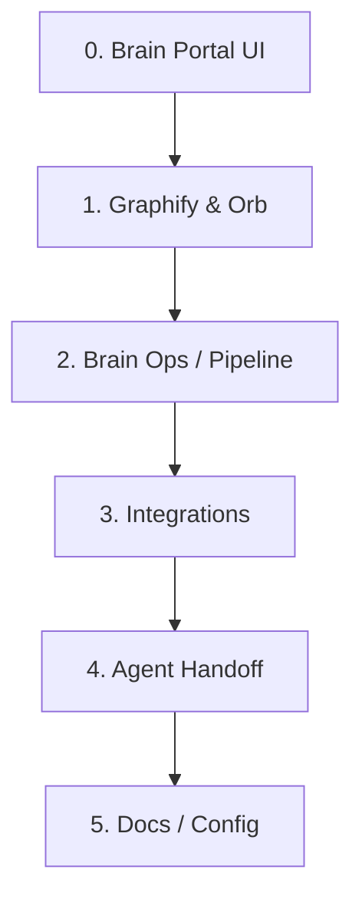

# Agent Graph Index — Cinema Machina Core

This document provides a consolidated, high-level map of the repository's architecture and macro-sections. It acts as the primary entry point for AI agents (Codex, Antigravity, Claude Code) to orient themselves in this codebase.

---

## 1. Macro-Sections Overview

The codebase is organized into **6 Macro-Sections**, representing the primary system boundaries and functional domains:

| ID (`macroSectionId`) | Macro-Section (`macroSectionLabel`) | Primary Role | Key Directories / Files |
|---|---|---|---|
| **0** | **Brain Portal UI** | Live monitoring, status telemetry, web dashboard, 3D Graph | `tools/brain-portal/src/` |
| **1** | **Graphify / Orb Visualization** | AST-based repository relationship parser, visualizers | `graphify-out/`, `enrich-graphify.mjs` |
| **2** | **Brain Ops / Context Pipeline** | Handoff context compiler, periodic updates, shell scripts | `tools/brain-ops/` |
| **3** | **Integrations** | Ollama/Qwen, Langflow pipelines, RuFlo execution layers | `backend/` |
| **4** | **Agent Handoff** | Codex state management, Antigravity logs, Claude Code | `docs/AGENT_HANDOFF.md` |
| **5** | **Docs / Config / Runtime** | Configuration files, environment defaults, system manuals | `docs/`, `package.json`, `.env` |

---

## 2. Hybrid Node Schema Mapping

Nodes returned by `/api/graphify/graph` include both Graphify's original extraction data and Cinema Machina's macro-organization layer:

- **`community`**: The original Graphify-extracted community ID (integer or string). Use this for machine graph intelligence and agent-facing query integrity.
- **`graphifyCommunity`**: Explicit copy of the original Graphify community ID.
- **`macroSectionId`**: Stable 0–5 ID mapping the node to one of the 6 Cinema Machina domains.
- **`macroSectionLabel`**: Human-readable label for the macro-section.
- **`subcluster`**: Specific file categories within a macro-section:
  - `routes`
  - `components`
  - `adapters`
  - `scripts`
  - `docs`
  - `generated-artifacts`
  - `runtime`
  - `other`

## 2A. Business Cluster Schema

The Brain Portal now adds a second, product-facing classification layer at API response time. Raw `graphify-out/graph.json` remains unchanged.

Every node returned by `/api/graphify/graph` includes:

- **`clusterId`**: Stable business cluster ID `0-13`.
- **`clusterName`**: Human-readable business cluster name.
- **`clusterGroup`**: Higher-level grouping such as `brain`, `agents`, `local-ai`, `media`, or `support`.
- **`clusterDescription`**: Short explanation of why the node belongs to that business cluster.
- **`cleanLabel`**: Display label suitable for the Orb and inspector.
- **`sourceKind`**: `file`, `symbol`, `doc`, `config`, `runtime`, `virtual-hub`, or `unknown`.
- **`importance`**: Normalized node importance used by the Orb.
- **`actionableSummary`**: One-line next action for the selected node.

Business clusters:

| ID | Cluster |
|---|---|
| 0 | Cinema Machina AI Brain |
| 1 | Cinema Machina Core |
| 2 | Cinema Machina Website |
| 3 | AI Tools and Agents |
| 4 | Codex Workspace |
| 5 | Antigravity Workspace |
| 6 | Local AI / Qwen / Ollama |
| 7 | Langflow Orchestration |
| 8 | RuFlo Workflows |
| 9 | Graphify Knowledge Graph |
| 10 | GitHub / Vercel / Repos |
| 11 | Plex / Jellyfin / Movie Library |
| 12 | Home Cinema / Client Signal Chain |
| 13 | Docs / Config / Runtime |

The API may add up to 14 virtual hub nodes. Hub nodes have `sourceKind: "virtual-hub"`, `isClusterHub: true`, and `importance: 100`.

---

## 3. Recommended Entry Points for Investigation

- **System Health & Telemetry:** `tools/brain-portal/src/app/api/status/route.ts`
- **Graph Generation API:** `tools/brain-portal/src/app/api/graphify/graph/route.ts`
- **Handoff & Session Memory:** `docs/AGENT_HANDOFF.md`
